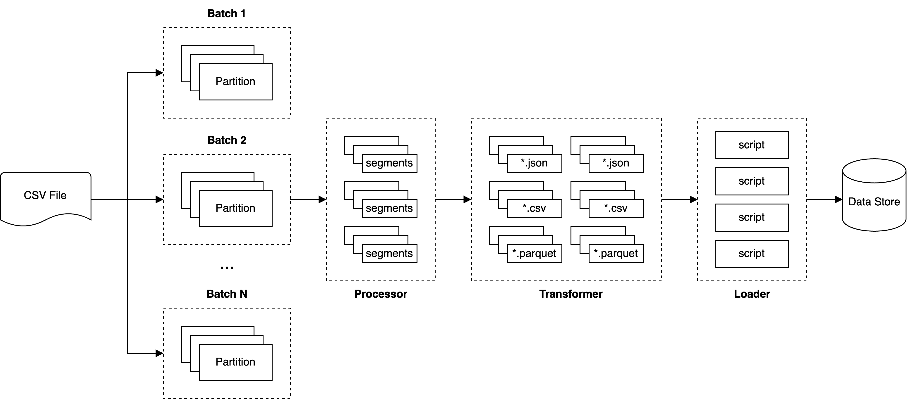
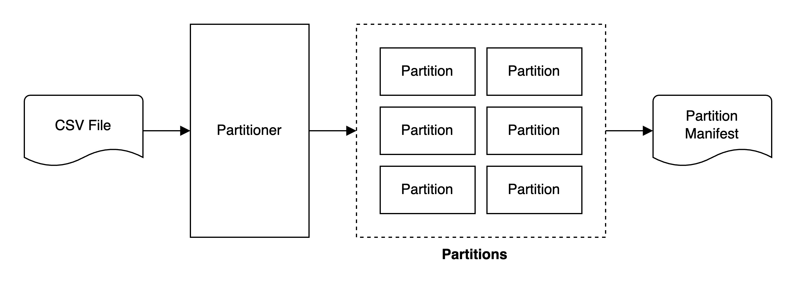
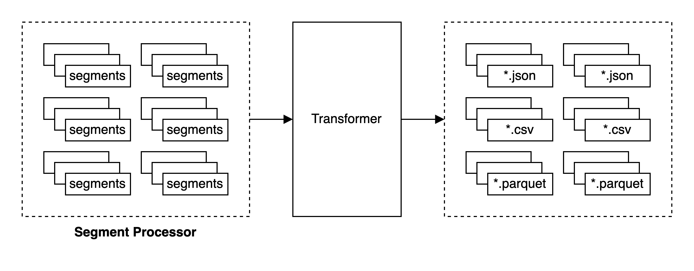
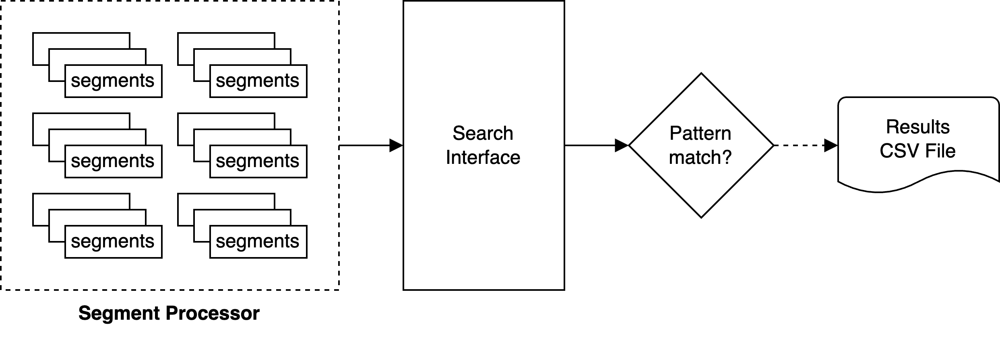
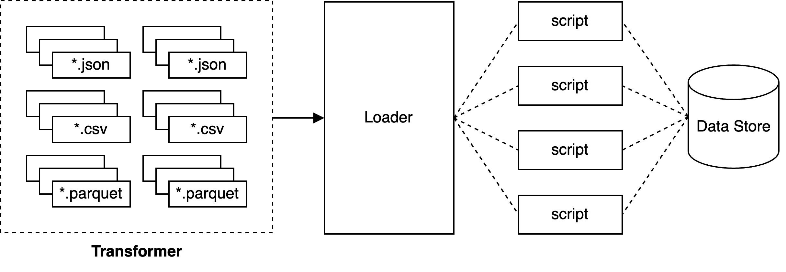

# ScaleETL

Partition, Transform, Load, and Search large CSV files.



The core idea behind this architecture is to be able to adjust parameters to scale the system as per the amount of computing available in the environment. For instance, the system can process more batches on a CPU with more threads.

## Development

The system is implemented as a standard Go CLI application, checkout the `Makefile` for available commands.

Generate sample test files using the `make generate_sample_data` command for development, benchmarks etc.

```sh
$ make generate_sample_data
Generated sample data
4.0K    samples/sample_1k.csv
240K    samples/sample_10k.csv
2.3M    samples/sample_100k.csv
 23M    samples/sample_1m.csv
230M    samples/sample_10m.csv
2.3G    samples/sample_100m.csv
 23G    samples/sample_1b.csv
```

## Build

`amd64` and `arm64` binaries are available for `linux`, `windows`, and `darwin` via the [build github action](https://github.com/karanpratapsingh/scale-etl/actions/workflows/build.yml).

## Features

Benchmarks were done on Apple M4 CPU with 16 GB Memory. `scripts/pandas_benchmark.sh` has benchmark implementation for [pandas](https://pandas.pydata.org).

### Partition

Partition input CSV file into multiple smaller files.



**Partition Manifest**

The manifest includes information about how the CSV file is partitioned into smaller chunks, specifying the start and end buffer indices of each partition.

```js
{
  "total_rows": <int>,
  "partition_size": <int>,
  "partitions": [
    { "start": <int>, "end": <int> },
    { "start": <int>, "end": <int> }
  ]
}
```

**Usage**

```sh
$ scale-etl partition [command options] [arguments...]

OPTIONS:
   --file-path value       Input CSV file path
   --partition-dir value   Output directory for partition manifest files (default: "partitions")
   --partition-size value  Partition size (default: 0)
```

**Example**

```sh
$ scale-etl partition --file-path samples/sample_10m.csv --partition-size 100000
```

**Benchmark**

| Sample Size | Partition Size | Pandas    | ScaleETL   | Improvement |
| ----------- | -------------- | --------- | ---------- | ----------- |
| 100k        | 10,000         | 24.4ms    | 4.7525ms   | 5.13x       |
| 1m          | 10,000         | 196.8ms   | 35.5033ms  | 5.54x       |
| 10m         | 100,000        | 2.0143s   | 297.9035ms | 6.76x       |
| 100m        | 1,000,000      | 31.0396s  | 2.9237s    | 10.62x      |
| 1b          | 1,000,000      | 462.6593s | 28.6994s   | 16.12x      |

### Transform

Transform partitions into a particular format (`dynamodb`, `parquet`, `json`, `csv`).



**Schema**

YAML structure represents a schema definition used by the transformer for a given CSV file. Optional fields such as `table_name`, `key` can be used in certain scenarios. For example, the `table_name` field is can for transform type `dynamodb`.

```yaml
table_name: <str> [optional]
key: <str> [optional]
columns:
  - <name>: <type>
```

**Usage**

```sh
$ scale-etl transform [command options] [arguments...]

OPTIONS:
   --file-path value       Input CSV file path
   --partition-dir value   Output directory for partition manifest files (default: "partitions")
   --batch-size value      Number of partitions to be processed concurrently (default: 5)
   --segment-size value    Size of segment each partition will be divided into (default: 0)
   --schema-path value     Schema file path (default: "schema.yaml")
   --delimiter value       Delimiter character (default: ",")
   --no-header             CSV file does not have a header row (default: false)
   --transform-type value  Output format of the transform (default: "csv")
   --output-dir value      Output directory for transformed files (default: "output")
```

**Example**

```sh
$ scale-etl transform --file-path samples/sample_10m.csv --segment-size 10000
```

**Benchmark**

| Sample Size | Batch Size | Segment Size | Pandas   | ScaleETL   | Improvement |
| ----------- | ---------- | ------------ | -------- | ---------- | ----------- |
| 100k        | 10         | 10,000       | 64.4ms   | 9.0974ms   | 7.08x       |
| 1m          | 10         | 10,000       | 622.0ms  | 81.0755ms  | 7.67x       |
| 10m         | 20         | 10,000       | 6.7087s  | 470.2074ms | 14.27x      |
| 100m        | 20         | 100,000      | 75.2270s | 4.2702s    | 17.62x      |
| 1b          | 20         | 100,000      | 988.845s | 83.0932s   | 11.90x      |

### Search

Searches partitions for a specific pattern.



**Usage**

```sh
   --pattern value        Search pattern
   --output value         Output CSV file path (default: "matches.csv")
   --file-path value      Input CSV file path
   --partition-dir value  Output directory for partition manifest files (default: "partitions")
   --batch-size value     Number of partitions to be processed concurrently (default: 5)
   --segment-size value   Size of segment each partition will be divided into (default: 0)
   --schema-path value    Schema file path (default: "schema.yaml")
   --delimiter value      Delimiter character (default: ",")
   --no-header            CSV file does not have a header row (default: false)
```

**Example**

```sh
$ scale-etl search --file-path samples/sample_10m.csv --segment-size 10000 --pattern abc
```

**Benchmark**

| Sample Size | Segment Size | Pandas     | ScaleETL   | Improvement |
| ----------- | ------------ | ---------- | ---------- | ----------- |
| 100k        | 10,000       | 81.5ms     | 6.9068ms   | 11.80x      |
| 1m          | 10,000       | 787.9ms    | 66.3535ms  | 11.88x      |
| 10m         | 100,000      | 8.0919s    | 529.3998ms | 15.29x      |
| 100m        | 1,000,000    | 100.8681s  | 4.9546s    | 20.36x      |
| 1b          | 1,000,000    | 1492.5549s | 50.5780s   | 29.51x      |

### Load

Load transformed segments concurrently.



**Usage**

```sh
$ scale-etl load [command options] [arguments...]

OPTIONS:
   --file-path value    Input CSV file path
   --output-dir value   Output directory for transformed files (default: "output")
   --pool-size value    Number of concurrent calls of the specified script (default: 0)
   --script-path value  Path of script to be executed for each segment
```

**Example**

```sh
$ scale-etl load --file-path samples/sample_10m.csv --pool-size 50 --script-path ./scripts/sample_load_script.sh
```

**Benchmark**

Loader benchmark can be quite subjective as there are a lot of external factors to consider like data store latency and network bandwidth. Below is a sample benchmark for PostgreSQL 16.1 running on Docker 28.5.1 (`scripts/sample_pg_load_script.sh`).

| Sample Size | Segment Size | Time       |
| ----------- | ------------ | ---------- |
| 100k        | 10,000       | 12.1287ms  |
| 1m          | 10,000       | 96.2360ms  |
| 10m         | 100,000      | 541.4265ms |
| 100m        | 1,000,000    | 4.7879s    |
| 1b          | 1,000,000    | 48.6179s   |

## Future Scope

Potential areas of future development and improvement:

- In partitions streaming without reading the entire file and creating a partition manifest.
- Remove, Add or Derive a column from an existing columns.
- View/stream any partition within a specified range.
- RESTful interface for all core features.
- Multiple input formats (xls, JSON, etc) support.
