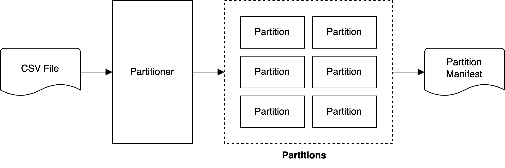
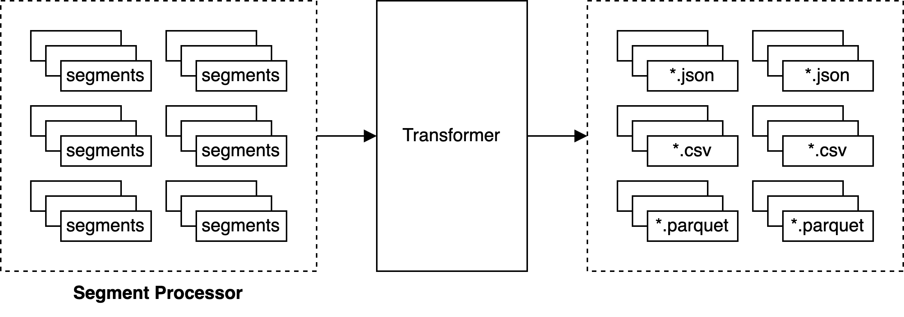

# CSV ETL (TODO NAME)

ETL CLI for billion row CSV file...TODO

TODO: Paper link


## Benchmarks
TODO

add a graph for time taken for each command (depicts the non-linear increase in time)

## Commands
TODO

_Note: use `todo_name -h` for list of all the commands._

### Partition
TODO



**Example**

```sh
$ todo_name partition --file-path samples/sample_10m.csv --partition-size 100000
```

### Transform
TODO



**Example**

```sh
$ todo_name transform --file-path samples/sample_10m.csv --segment-size 10000
```

### Search
TODO


**Example**

```sh
$ todo_name search --file-path samples/sample_10m.csv --segment-size 10000 --pattern abc
```

### Load
TODO
not specific to any data store


**Example**

```sh
$ todo_name load --file-path samples/sample_10m.csv --pool-size 50 --script-path ./scripts/sample_load_script.sh
```

### Clean
TODO

**Example**

```sh
$ todo_name clean --file-path samples/sample_10m.csv
```

## Development

It's a standard Go CLI application, checkout the `Makefile` for available commands. Generate sample test files using the `scripts/generate_sample_data.go`

```sh
$ make generate_sample_data
Generated sample data
4.0K    samples/sample_1k.csv
240K    samples/sample_10k.csv
2.3M    samples/sample_100k.csv
 23M    samples/sample_1m.csv
230M    samples/sample_10m.csv
2.3G    samples/sample_100m.csv
 23G    samples/sample_1b.csv
```
